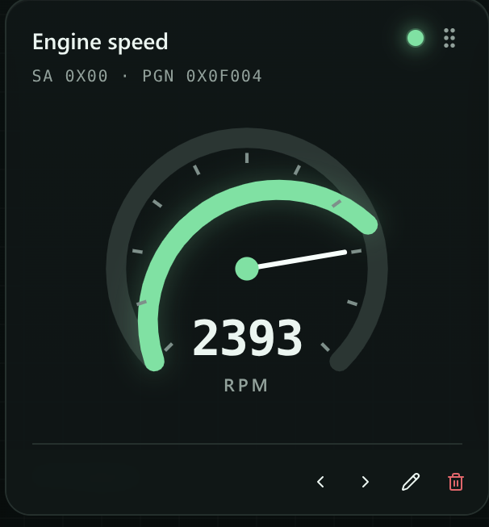
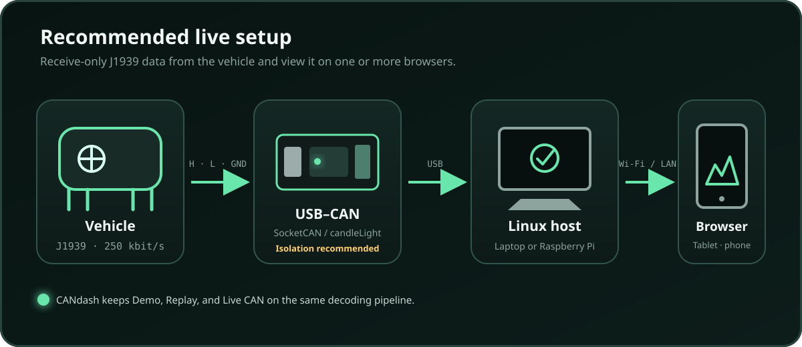
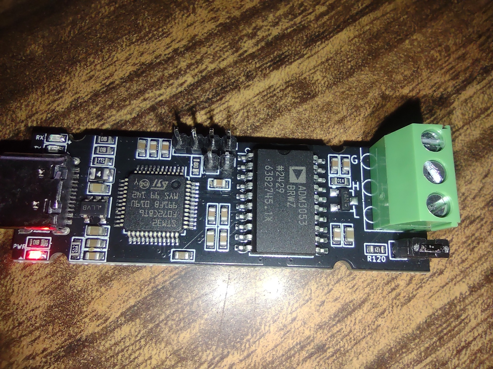
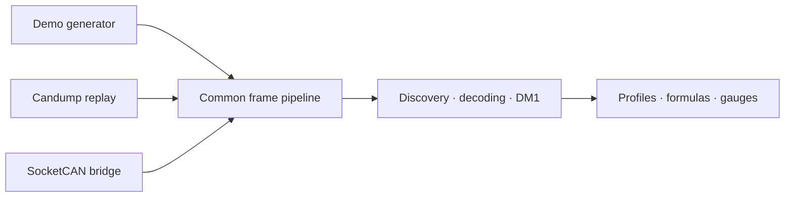

<p align="center">
  
</p>

<h1 align="center">CANdash</h1>

<p align="center">
  A local-first, receive-only J1939 dashboard for Linux, Raspberry Pi, tablets, and phones.
</p>

<p align="center">
  
  
  
  
</p>

<p align="center">
  
</p>

CANdash turns SAE J1939 traffic into configurable browser gauges. It was built
and tested around real captures from a **Volare V8L 4x4 with a Cummins ISF 3.8
CM2220**, while keeping source addresses, PGNs, signal definitions, gauge types,
units, and complete dashboard profiles editable.

> [!IMPORTANT]
> The current release is deliberately **receive-only**. Demo and log replay run
> entirely in the browser. Live SocketCAN uses a small Python WebSocket bridge
> that contains no CAN-transmit endpoint.

## Why CANdash?

- **Useful without hardware:** open the browser and select Demo, or replay a
  timestamped candump file.
- **Designed for real J1939 networks:** match data by source address + PGN,
  discover ECUs passively, import DBC files, and keep fallback sources.
- **Portable dashboards:** profiles, custom signals, formulas, gauges, and
  layouts can be saved, exported, and shared as JSON.
- **One pipeline:** Demo, Replay, and Live CAN all feed the same decoder,
  statistics, diagnostics, and gauge engine.
- **Local-first:** profiles stay in browser storage; imported DBC files stay in
  IndexedDB; no cloud service is required.

## What it looks like

The dashboard is responsive for laptops, mounted displays, tablets, and phones.
Every accepted update pulses a green activity LED. Gauges can optionally show
session MIN, time-weighted AVG, and MAX markers, with separate visibility
controls for each statistic and its numeric label.

<p align="center">
  
</p>

## Features

| Dashboard and gauges | CAN and decoding | Replay and analysis |
| --- | --- | --- |
| Circular, pressure, temperature, bar, numeric, odometer, formula, and line-history gauges | Passive ECU, source-address, and PGN discovery | Timestamped candump `-L` replay |
| Responsive drag/reorder layout | Source-aware signal matching | Play, pause, seek, loop, and live speed control |
| Green update pulse on every accepted value | Custom DBC-style bit definitions | Logical clock freezes freshness and statistics while paused |
| Per-gauge EMA and rolling-mean smoothing | Local DBC import and searchable signal picker | Compact real-drive sample included |
| Session MIN / time-weighted AVG / MAX markers | Primary and fallback signal sources | Read-only DM1 decoding with BAM reassembly |
| Common and custom-linear unit conversions | J1939 unavailable/error filtering | Demo generator for hardware-free testing |
| Safe arithmetic formula gauges | Stale-value handling | Capture-derived source-aware reference DBC |

## Quick start on Ubuntu

### Requirements

- Node.js **22.13 or newer**
- A modern browser
- Python 3 only when using Live CAN

```bash
npm ci
npm run dev
```

Open the URL printed by Vite—normally
[`http://localhost:5173`](http://localhost:5173)—then use the source button in
the upper-right.

| Source | Best for | Additional setup |
| --- | --- | --- |
| **Demo** | Exploring the dashboard and testing profiles | None |
| **Replay** | Development, debugging, and repeatable tests | Select a candump `-L` log |
| **Live CAN** | A connected vehicle or bench network | SocketCAN interface + Python bridge |

### Replay a capture

Select **Replay** and open a log written in candump `-L` format:

```text
(0.367482) can0 0CFE6CEE#001F7FCC00000000
```

`sample-data/volare-drive-key-pgns.log` is included for immediate testing. The
browser accepts timestamps with six or nine fractional digits, although
`canplayer` itself requires exactly six.

### Read live SocketCAN

Configure the interface in Linux listen-only mode first. The bridge does not
change interface settings and cannot make a transmitting interface passive.

```bash
sudo ip link set can0 down
sudo ip link set can0 type can bitrate 250000 listen-only on
sudo ip link set can0 up

python3 -m venv .venv
. .venv/bin/activate
pip install -r bridge/requirements.txt
python bridge/server.py --interface can0
```

Keep `npm run dev` running in another terminal. In CANdash, select **Live CAN**
and connect to:

```text
ws://127.0.0.1:8765/ws
```

Bridge health is available at
[`http://127.0.0.1:8765/health`](http://127.0.0.1:8765/health).

### Open CANdash from a tablet or phone

On the same trusted Wi-Fi/LAN:

1. Run the bridge with `--host 0.0.0.0`.
2. Open `http://LAPTOP_IP:5173` on the remote device.
3. Set Live CAN to `ws://LAPTOP_IP:8765/ws`.

There is currently no authentication or TLS. Do not expose the development
server or bridge directly to the public internet.

## Suggested hardware

CANdash is hardware-agnostic as long as the Linux host exposes a SocketCAN
interface. A practical setup is:

| Component | Recommendation | Notes |
| --- | --- | --- |
| Linux host | Ubuntu laptop for development; Raspberry Pi 4/5 for a mounted installation | The browser can run locally or on another device |
| CAN interface | Isolated candleLight/gs_usb-compatible USB–CAN adapter | Electrical isolation is strongly recommended in a vehicle |
| Vehicle harness | Proper J1939 diagnostic connector or fused custom harness | Connect CAN-H, CAN-L, and CAN-side ground correctly |
| Display | Existing laptop, HDMI touchscreen, Android/LineageOS tablet, or phone | Any modern browser on the trusted LAN can display CANdash |
| Vehicle power | Automotive-rated DC/DC supply, ideally with orderly shutdown support | Important for a permanently installed Raspberry Pi |

<details>
<summary><strong>Development USB–CAN adapter</strong></summary>

<br>

<p align="center">
  
</p>

The photographed adapter is candleLight/gs_usb compatible and includes an
isolated CAN transceiver. Its `R120` termination jumper is installed in the
photo. **Remove that jumper when attaching to the middle of an already
terminated vehicle network**, such as through the Volare diagnostic connector.
Only add termination when the adapter is actually an endpoint on a bench bus.

</details>

## Profiles and signal definitions

Every ordinary gauge stores one or more sources. A source is:

```text
source address + PGN + signal definition
```

The signal definition includes bit position, bit length, byte order, signedness,
scale, offset, unit, physical limits, and J1939 invalid-value policy. Profiles
also preserve gauge type, order, range, stale timeout, smoothing, statistic
display, and network defaults.

Profiles are stored in browser local storage and can be exported as JSON. The
export is the portable backup and sharing mechanism. The checked-in
`reference/volare-profile-original.json` documents the earlier profile format;
the running application exports its current schema.

Imported DBC files are parsed locally and stored in browser IndexedDB. They
label matching PGNs in Discover and populate the gauge editor. When a gauge is
created from a DBC, its signal definition is copied into the profile, so the
gauge remains portable even if that DBC is later removed.

## Formulas, conversions, and averages

Display conversion runs after signal decoding. Built-in presets cover km/h to
mph, km to miles, Celsius to Fahrenheit, kPa to psi, and litres/hour to US
gallons/hour. A custom linear scale, offset, and unit can also be supplied.

Formula gauges refer to existing gauge IDs in braces:

```text
{vehicle-speed} / {fuel-rate}
```

Formula evaluation uses the project's restricted arithmetic parser and never
executes user input as JavaScript. `AVG({gauge-id})` references a source
gauge's session-long, time-weighted average:

```text
AVG({vehicle-speed}) / AVG({fuel-rate})
```

For a simple rate ratio, ratio-of-integrals mode accumulates both inputs
independently. Integrating km/h and L/h produces total distance divided by total
fuel, rather than the misleading arithmetic mean of instantaneous km/L values.

Zero remains a valid fresh CAN reading. An undefined result—such as division by
zero—shows an em dash instead of retaining an old value.

### Smoothing and session statistics

- **EMA:** recommended for rapidly changing values; 3–5 seconds is a useful
  starting point for instantaneous fuel economy.
- **Rolling mean:** averages readings over a fixed recent period.
- **Long AVG:** runs from source-session start using time weighting.
- **Ratio of integrals:** intended for compatible rate-based formula gauges.

Smoothing affects the displayed value; the green activity LED still pulses for
every accepted update. Long averages reset when a source starts or replay is
repositioned.

Every gauge type can display MIN, AVG, and MAX using its own geometry: radial
ticks on circular gauges, horizontal references on thermometers and history
plots, and range ticks on bar, numeric, formula, and odometer gauges. Marker
strokes are 1 px; MIN and MAX are yellow, while AVG is blue.

## Architecture



- `app/`, `components/`: browser dashboard
- `lib/can/`: J1939 identifiers, decoding, DBC parsing, formulas, replay, and profiles
- `bridge/server.py`: receive-only SocketCAN-to-WebSocket bridge
- `reference/`: capture-derived reference material
- `sample-data/`: filtered real-drive replay sample
- `tests/`: protocol, replay, transport, statistics, and rendered-page tests

The reference DBC helps analysis, but runtime gauges use self-contained profile
definitions. This allows custom PGNs and source-specific variants without
requiring one DBC per ECU.

## Data-quality note

The built-in Volare values are capture-derived rather than OEM-authoritative.
The project includes verified corrections for ET1 coolant temperature
(`1 °C/bit, -40 °C`) and VDHR distance (`0.005 km/bit`). Validate safety-critical
or maintenance-critical readings against calibrated instrumentation.

## Diagnostics safety boundary

CANdash can passively observe DM1 fault traffic. Diagnostic requests, fault
clearing, and all other J1939 transmission are intentionally unimplemented. A
future write mode must be a separate, explicit maintenance capability with
confirmation, audit logging, bus-state checks, and a visible departure from
listen-only operation.

## Development and validation

```bash
npm run lint
npm run build
npm test
python3 -m py_compile bridge/server.py
```

See `AGENTS.md` for the architecture, safety boundary, and contributor rules.

## Project note

CANdash began as an AI-generated project driven by real requirements, captures,
and vehicle testing. The maintainer is learning and validating the system as it
evolves. Review, test reports, documentation improvements, and contributions
are welcome—especially from people experienced with J1939, SocketCAN, embedded
Linux, and accessible dashboard design.

## License

Application code is MIT licensed. See `THIRD_PARTY_NOTICE.txt` for notices
covering generic J1939 DBC definitions retained in the corrected reference DBC.
